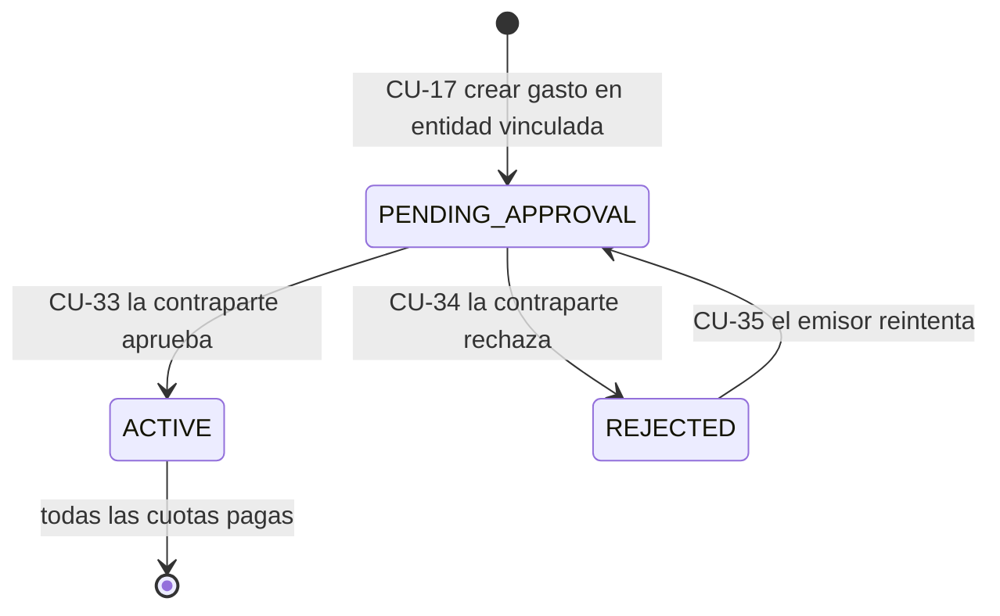
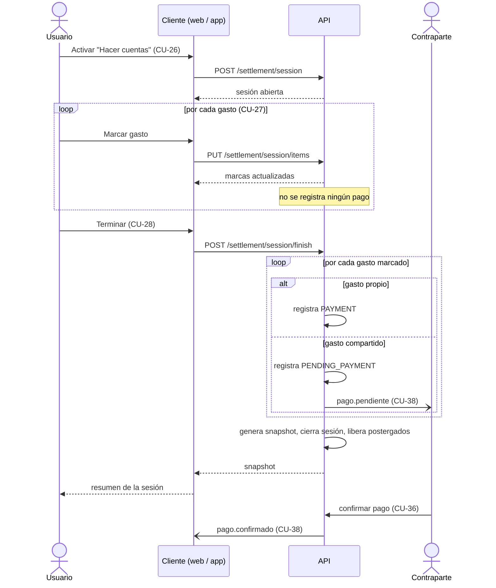

# Casos de uso

Especificación de los casos de uso del sistema. Los requerimientos que cada uno realiza están en [requerimientos-funcionales.md](requerimientos-funcionales.md); los términos del dominio, en el glosario de [README.md](README.md).

- [Actores](#actores)
- [Diagrama general](#diagrama-general)
- [Catálogo](#catálogo)
- Especificaciones: [Autenticación, configuración y dashboard](#1-autenticación-configuración-y-dashboard) · [Entidades financieras](#2-entidades-financieras) · [Gastos](#3-gastos) · [Hacer cuentas](#4-hacer-cuentas) · [Gastos compartidos](#5-gastos-compartidos)
- [Diagramas de comportamiento](#diagramas-de-comportamiento)

## Actores

| Actor | Tipo | Descripción |
| --- | --- | --- |
| **Visitante** | Primario | Persona sin sesión iniciada. Solo puede registrarse o iniciar sesión. |
| **Usuario** | Primario | Persona con sesión iniciada. Gestiona sus entidades, gastos, pagos y sesiones de cuentas. |
| **Contraparte** | Primario | Otro usuario de la plataforma vinculado a una entidad del Usuario. Aprueba o rechaza los gastos que le comparten y confirma o rechaza los pagos. Es un Usuario visto desde el otro lado de la relación. |
| **Firebase** | Sistema externo | Autentica la identidad de Google del visitante. |
| **Pusher** | Sistema externo | Entrega las notificaciones en tiempo real a los clientes. |

## Diagrama general

## Catálogo

| CU | Nombre | Actor principal | Diagrama |
| --- | --- | --- | --- |
| CU-01 | Registrarse | Visitante | [01](diagramas/01_autenticacion_configuracion.svg) |
| CU-02 | Iniciar sesión con email | Visitante | 01 |
| CU-03 | Iniciar sesión con Google | Visitante | 01 |
| CU-04 | Cerrar sesión | Usuario | 01 |
| CU-05 | Ver perfil | Usuario | 01 |
| CU-06 | Cambiar moneda preferida | Usuario | 01 |
| CU-07 | Registrar sueldo | Usuario | 01 |
| CU-08 | Consultar dashboard | Usuario | 01 |
| CU-09 | Listar y buscar entidades | Usuario | [02](diagramas/02_entidades.svg) |
| CU-10 | Crear entidad | Usuario | 02 |
| CU-11 | Renombrar entidad | Usuario | 02 |
| CU-12 | Eliminar entidad | Usuario | 02 |
| CU-13 | Marcar entidad como favorita | Usuario | 02 |
| CU-14 | Ver detalle de entidad | Usuario | 02 |
| CU-15 | Vincular / desvincular usuario | Usuario | 02 |
| CU-16 | Ver gastos eliminados | Usuario | 02 |
| CU-17 | Crear gasto | Usuario | [03](diagramas/03_gastos.svg) |
| CU-18 | Ver detalle de gasto | Usuario | 03 |
| CU-19 | Editar gasto | Usuario | 03 |
| CU-20 | Eliminar gasto | Usuario | 03 |
| CU-21 | Pagar o cobrar cuota | Usuario | 03 |
| CU-22 | Revertir último pago | Usuario | 03 |
| CU-23 | Postergar gasto | Usuario | 03 |
| CU-24 | Marcar gasto como favorito | Usuario | 03 |
| CU-25 | Gestionar categorías | Usuario | 03 |
| CU-26 | Iniciar sesión de cuentas | Usuario | [04](diagramas/04_hacer_cuentas.svg) |
| CU-27 | Marcar o desmarcar gastos | Usuario | 04 |
| CU-28 | Finalizar sesión de cuentas | Usuario | 04 |
| CU-29 | Descartar sesión | Usuario | 04 |
| CU-30 | Consultar historial de cuentas | Usuario | 04 |
| CU-31 | Compartir resumen por WhatsApp | Usuario | 04 |
| CU-32 | Ver compartidos | Usuario | [05](diagramas/05_compartidos.svg) |
| CU-33 | Aprobar gasto compartido | Contraparte | 05 |
| CU-34 | Rechazar gasto compartido | Contraparte | 05 |
| CU-35 | Reintentar gasto rechazado | Usuario | 05 |
| CU-36 | Confirmar pago compartido | Contraparte | 05 |
| CU-37 | Rechazar pago compartido | Contraparte | 05 |
| CU-38 | Recibir notificaciones en tiempo real | Usuario, Contraparte | 05 |

**Precondición común**: salvo CU-01, CU-02 y CU-03, todos los casos de uso requieren que el actor tenga una sesión iniciada. No se repite en cada especificación.

---

## 1. Autenticación, configuración y dashboard

### CU-01 — Registrarse

- **Actor**: Visitante
- **Requerimientos**: RF-AUT-01, RF-AUT-02
- **Precondición**: el visitante no tiene sesión iniciada.
- **Flujo principal**
    1. El visitante abre la pantalla de registro.
    2. Ingresa nombre, email y contraseña y confirma.
    3. El sistema verifica que el email no esté registrado.
    4. El sistema crea la cuenta guardando la contraseña cifrada.
    5. El sistema lleva al visitante al inicio de sesión.
- **Flujos alternativos**
    - 2a. El nombre tiene menos de 2 caracteres, el email no es válido o la contraseña tiene menos de 6 caracteres: el cliente muestra el error en el formulario y no envía nada.
    - 3a. El email ya pertenece a una cuenta: el sistema muestra el error en el formulario y no crea la cuenta.
- **Postcondición**: existe una cuenta nueva. El visitante todavía no tiene sesión.

### CU-02 — Iniciar sesión con email

- **Actor**: Visitante
- **Requerimientos**: RF-AUT-03, RF-AUT-06, RF-AUT-09
- **Flujo principal**
    1. El visitante ingresa email y contraseña.
    2. El sistema valida las credenciales.
    3. El sistema emite un token de sesión y devuelve los datos del usuario.
    4. El cliente guarda el token y los datos, y muestra el dashboard.
- **Flujos alternativos**
    - 2a. El email no existe o la contraseña no coincide: el sistema muestra "email o contraseña incorrectos" en el formulario, sin distinguir el motivo.
    - 1a. El visitante llegó a esta pantalla porque su sesión anterior venció: sobre el formulario se muestra el cartel "Tu sesión venció". Desaparece al iniciar sesión.
- **Postcondición**: el visitante pasa a ser Usuario con sesión iniciada.

### CU-03 — Iniciar sesión con Google

- **Actores**: Visitante, Firebase
- **Requerimientos**: RF-AUT-04, RF-AUT-05, RF-AUT-06
- **Flujo principal**
    1. El visitante elige "Continuar con Google".
    2. Firebase autentica al visitante y devuelve su identidad (nombre, email, foto, identificador).
    3. El sistema busca una cuenta asociada a esa identidad de Google y la encuentra.
    4. El sistema emite el token; el cliente lo guarda y muestra el dashboard.
- **Flujos alternativos**
    - 2a. El visitante cancela o Firebase falla: no se inicia sesión.
    - 3a. *Vincular Google a cuenta existente* («extend»): no hay cuenta con esa identidad pero sí una con el mismo email, creada con credenciales. El sistema asocia la identidad de Google a esa cuenta y continúa en 4.
    - 3b. No hay cuenta con esa identidad ni con ese email: el sistema crea una cuenta nueva sin contraseña y continúa en 4.
- **Postcondición**: sesión iniciada. Nunca quedan dos cuentas con el mismo email.

### CU-04 — Cerrar sesión

- **Actor**: Usuario
- **Requerimientos**: RF-AUT-08
- **Flujo principal**
    1. El usuario elige "Cerrar sesión".
    2. El sistema pide confirmación.
    3. El usuario confirma.
    4. El cliente elimina el token y los datos guardados y muestra el inicio de sesión.
- **Flujos alternativos**
    - 3a. El usuario cancela: la sesión continúa.
- **Postcondición**: no queda sesión en el dispositivo. Una sesión de cuentas abierta **no** se pierde (está guardada en el servidor).

### CU-05 — Ver perfil

- **Actor**: Usuario
- **Requerimientos**: RF-CFG-01
- **Flujo principal**
    1. El usuario abre Configuración.
    2. El sistema muestra su foto, nombre y email, su moneda preferida y su sueldo.

### CU-06 — Cambiar moneda preferida

- **Actor**: Usuario
- **Requerimientos**: RF-CFG-02
- **Flujo principal**
    1. En Configuración, el usuario elige ARS, USD, EUR, BRL, CLP o UYU.
    2. El sistema guarda la preferencia.
    3. El cliente actualiza los datos del usuario guardados en el dispositivo.
- **Flujos alternativos**
    - 2a. La moneda no es una de las admitidas: el sistema la rechaza.
- **Postcondición**: las equivalencias del dashboard se expresan en la nueva moneda.

### CU-07 — Registrar sueldo

- **Actor**: Usuario
- **Requerimientos**: RF-CFG-03
- **Flujo principal**
    1. En Configuración, el usuario ingresa su sueldo y la moneda en la que lo cobra.
    2. El sistema valida que sea un número mayor o igual a cero y lo guarda.
- **Flujos alternativos**
    - 2a. El valor no es numérico o es negativo: el sistema lo rechaza.
- **Postcondición**: las métricas "porcentaje del sueldo" usan el nuevo valor.

### CU-08 — Consultar dashboard

- **Actor**: Usuario
- **Requerimientos**: RF-DSH-01 a RF-DSH-08, RF-DSH-10
- **Flujo principal**
    1. El usuario abre el dashboard.
    2. El sistema obtiene las entidades con sus gastos activos y las ordena (favoritas primero, luego por gasto más reciente).
    3. El sistema calcula por moneda los totales "debo", "me deben" y balance.
    4. El sistema obtiene la cotización de USD, EUR, BRL, CLP y UYU.
    5. El sistema muestra los balances, los gastos agrupados por entidad y, si corresponde, la cantidad de gastos compartidos pendientes.
- **Flujos alternativos**
    - 5a. *Cambiar moneda de visualización* («extend»): el usuario elige una moneda; el sistema muestra solo los gastos y totales de esa moneda.
    - 5b. El usuario filtra por texto, por tipo o por gasto fijo: el sistema muestra solo los gastos que coinciden.
    - 5c. El usuario abre los gráficos: el sistema muestra cuotas, montos y distribución por categoría.
    - 5d. El usuario oculta o muestra la columna de balances: el cliente recuerda la preferencia.
    - 4a. No se pudo obtener la cotización: el dashboard se muestra sin equivalencias.

---

## 2. Entidades financieras

### CU-09 — Listar y buscar entidades

- **Actor**: Usuario
- **Requerimientos**: RF-ENT-01
- **Flujo principal**
    1. El usuario abre Entidades.
    2. El sistema muestra sus entidades con la cantidad de gastos, los pendientes y a quién está vinculada cada una.
    3. El usuario escribe en el buscador; el sistema filtra por nombre.
- **Flujos alternativos**
    - 2a. No tiene entidades: el sistema muestra un estado vacío con la opción de crear una.
    - 2b. El usuario alterna entre vista de lista y de grilla.

### CU-10 — Crear entidad

- **Actor**: Usuario
- **Requerimientos**: RF-ENT-02, RF-ENT-03, RF-GAS-03
- **Flujo principal**
    1. El usuario elige "Nueva entidad" (desde Entidades, o desde el formulario de un gasto).
    2. Ingresa el nombre y, opcionalmente, el email de un usuario a vincular.
    3. El sistema verifica que no tenga otra entidad con ese nombre.
    4. El sistema crea la entidad y registra su creación en el historial.
    5. Si se indicó un email, el sistema ejecuta CU-15 (vincular).
- **Flujos alternativos**
    - 3a. Ya existe una entidad con ese nombre: el sistema lo informa y no la crea.
    - 5a. La vinculación falla: la entidad queda creada sin vincular y el sistema informa el motivo.
- **Postcondición**: la entidad existe y está disponible para asignarle gastos.

### CU-11 — Renombrar entidad

- **Actor**: Usuario
- **Requerimientos**: RF-ENT-04
- **Precondición**: la entidad pertenece al usuario.
- **Flujo principal**
    1. En el detalle de la entidad, el usuario elige editar e ingresa el nuevo nombre.
    2. El sistema verifica que ninguna otra entidad suya tenga ese nombre.
    3. El sistema guarda el nombre y registra en el historial el nombre anterior y el nuevo.
- **Flujos alternativos**
    - 2a. El nombre ya está en uso: el sistema lo informa y no cambia nada.

### CU-12 — Eliminar entidad

- **Actor**: Usuario
- **Requerimientos**: RF-ENT-05
- **Precondición**: la entidad pertenece al usuario.
- **Flujo principal**
    1. En el detalle de la entidad, el usuario elige "Eliminar entidad".
    2. El sistema pide confirmación.
    3. El usuario confirma; el sistema da de baja la entidad.
    4. El sistema vuelve al listado de entidades.
- **Postcondición**: la entidad y sus gastos dejan de mostrarse. Los datos se conservan.

### CU-13 — Marcar entidad como favorita

- **Actor**: Usuario
- **Requerimientos**: RF-ENT-06
- **Flujo principal**
    1. El usuario toca la estrella de una entidad.
    2. El cliente refleja el cambio de inmediato y lo envía al sistema.
- **Flujos alternativos**
    - 2a. El sistema rechaza el cambio: el cliente lo revierte.
- **Postcondición**: la entidad favorita aparece primero y se muestra en el dashboard aunque no tenga gastos activos.

### CU-14 — Ver detalle de entidad

- **Actor**: Usuario
- **Requerimientos**: RF-ENT-07, RF-ENT-08
- **Precondición**: la entidad pertenece al usuario.
- **Flujo principal**
    1. El usuario abre una entidad.
    2. El sistema muestra sus totales, a quién está vinculada y sus gastos separados en activos, finalizados y pendientes de aprobación.
    3. El usuario abre el historial; el sistema muestra los movimientos de la entidad.
- **Flujos alternativos**
    - 3a. *Filtrar por rango de fechas* («extend»): el usuario indica desde y hasta; el sistema muestra solo los movimientos de ese período.
    - 2a. El usuario copia el resumen de la entidad (CU-31), agrega un gasto (CU-17) o paga una cuota (CU-21, siempre directo).
    - 1a. La entidad no existe o no es suya: el sistema informa que no la encuentra.

### CU-15 — Vincular / desvincular usuario

- **Actor**: Usuario
- **Requerimientos**: RF-ENT-09, RF-ENT-10
- **Precondición**: la entidad pertenece al usuario.
- **Flujo principal (vincular)**
    1. En el detalle de la entidad, el usuario elige "Vincular" e ingresa el email de la contraparte.
    2. El sistema verifica que el email sea de un usuario registrado, que no sea el propio y que ese usuario no esté ya vinculado a otra de sus entidades.
    3. El sistema vincula la entidad y lo registra en el historial indicando con quién.
- **Flujo principal (desvincular)**
    1. El usuario elige "Desvincular".
    2. El sistema advierte y pide confirmación.
    3. El usuario confirma; el sistema quita el vínculo y lo registra en el historial.
- **Flujos alternativos**
    - 2a. No hay usuario con ese email: el sistema lo informa.
    - 2b. El email es el del propio usuario: el sistema lo impide.
    - 2c. Ese usuario ya está vinculado a otra entidad: el sistema informa a cuál.
- **Postcondición**: con la entidad vinculada, los gastos que se creen en ella serán compartidos (CU-17). Desvincular no modifica los gastos ya compartidos.

### CU-16 — Ver gastos eliminados

- **Actor**: Usuario
- **Requerimientos**: RF-ENT-11, RF-GAS-10
- **Precondición**: la entidad pertenece al usuario.
- **Flujo principal**
    1. En el detalle de la entidad, el usuario abre "Eliminados".
    2. El sistema muestra los gastos dados de baja de esa entidad.
- **Flujos alternativos**
    - 2a. *Restaurar gasto eliminado* («extend»): el usuario elige restaurar uno; el sistema lo vuelve a activar, lo registra en el historial de la entidad y el gasto reaparece entre los activos o finalizados.

---

## 3. Gastos

### CU-17 — Crear gasto

- **Actores**: Usuario; Contraparte (si la entidad está vinculada)
- **Requerimientos**: RF-GAS-01 a RF-GAS-06, RF-CAT-03, RF-CMP-01
- **Flujo principal**
    1. El usuario elige "Crear gasto" (desde el dashboard o desde una entidad).
    2. Indica tipo (egreso o ingreso), nombre, entidad, monto, moneda y modalidad: pago único, en cuotas o gasto fijo.
    3. Opcionalmente indica cuotas ya pagas, categorías y si queda postergado.
    4. El sistema verifica que la entidad exista y sea del usuario.
    5. El sistema crea el gasto como activo, registra su creación y un pago por cada cuota indicada como paga.
    6. El sistema registra "gasto creado" en el historial de la entidad y muestra el gasto en pantalla.
- **Flujos alternativos**
    - 2a. La entidad no existe todavía: el usuario la crea en el mismo formulario (CU-10).
    - 5a. *Pagar con otra entidad (espejo)* («extend»): el usuario eligió otra entidad propia como medio de pago. El sistema verifica esa entidad y crea además un gasto espejo en ella, con el tipo opuesto y los mismos datos, y enlaza ambos.
    - 5b. *Compartir con la contraparte* («extend»): la entidad está vinculada. El gasto se crea pendiente de aprobación, el sistema genera una copia pendiente para la contraparte y la notifica (CU-38). El gasto no aparece como activo hasta que sea aprobado (CU-33).
    - 4a. La entidad, o la entidad de pago, no existe o fue eliminada: el sistema lo informa y no crea nada.
    - 2b. Faltan datos obligatorios: el sistema lo informa.
- **Postcondición**: el gasto existe; según el caso, también su espejo y/o la copia de la contraparte.

### CU-18 — Ver detalle de gasto

- **Actor**: Usuario
- **Requerimientos**: RF-GAS-07, RF-GAS-13
- **Flujo principal**
    1. El usuario abre un gasto.
    2. El sistema muestra nombre, entidad, tipo, monto, moneda, categorías, progreso de pago (cuotas pagas, pendientes de confirmación y restantes) e historial de movimientos.
- **Flujos alternativos**
    - 2a. El gasto es fijo: en lugar del progreso se muestran los pagos realizados.
    - 1a. El gasto no existe o fue eliminado: el sistema lo informa.
    - 1b. El gasto no es del usuario: el sistema lo impide.

### CU-19 — Editar gasto

- **Actor**: Usuario
- **Requerimientos**: RF-GAS-08, RF-CAT-03
- **Flujo principal**
    1. En el detalle del gasto, el usuario elige editar.
    2. Modifica nombre, monto, tipo, condición de gasto fijo y/o categorías.
    3. El sistema guarda los cambios. Si cambió el nombre, lo registra en el historial de la entidad.
- **Flujos alternativos**
    - 3a. El gasto tiene espejo y el usuario eligió aplicar los cambios a ambos: el sistema actualiza también el espejo, manteniéndole el tipo opuesto.

### CU-20 — Eliminar gasto

- **Actor**: Usuario
- **Requerimientos**: RF-GAS-09
- **Flujo principal**
    1. En el detalle del gasto, el usuario elige eliminar.
    2. El sistema pide confirmación.
    3. El usuario confirma; el sistema da de baja el gasto y lo registra en el historial de la entidad.
    4. El sistema vuelve a la entidad.
- **Flujos alternativos**
    - 2a. El gasto tiene espejo: el sistema pregunta si eliminarlo también.
        - Sí: se dan de baja ambos.
        - No: se elimina solo este y se rompe el enlace con el espejo.
- **Postcondición**: el gasto puede restaurarse desde CU-16.

### CU-21 — Pagar o cobrar cuota

- **Actores**: Usuario; Contraparte (si el gasto es compartido)
- **Requerimientos**: RF-PAG-01 a RF-PAG-08
- **Precondición**: el gasto está activo y, si no es fijo, tiene cuotas sin pagar.
- **Flujo principal (pago directo)**
    1. El usuario elige pagar (egreso) o registrar cobro (ingreso) desde el detalle de una entidad, o desde el detalle de un gasto sin sesión de cuentas abierta.
    2. El sistema pide confirmación mostrando el gasto y el monto de la cuota.
    3. El sistema registra el pago de una cuota con la fecha actual.
    4. Si con ese pago el gasto queda saldado, deja de ser favorito.
    5. El sistema actualiza el progreso del gasto.
- **Flujos alternativos**
    - 1a. **Pago diferido**: hay una sesión de cuentas abierta y el usuario paga desde el dashboard o el detalle del gasto. El sistema solo marca el gasto en la sesión (CU-27) e informa que se registrará al terminar las cuentas.
    - 1b. El usuario intenta pagar desde el dashboard sin sesión abierta: el sistema lo impide y le indica que active "Hacer cuentas".
    - 1c. Pago diferido de un gasto postergado: el sistema lo impide.
    - 1d. El gasto no es de una entidad del usuario: el sistema lo impide.
    - 1e. El gasto no es fijo y ya tiene todas sus cuotas pagas: el sistema lo impide, tanto para el pago directo como para el diferido.
    - 3a. Pago directo de un gasto postergado: el sistema quita la postergación, lo registra en el historial y continúa.
    - 3b. *Registrar pago pendiente de confirmación* («extend»): el gasto es compartido. El pago se registra como pendiente, se notifica a la contraparte (CU-38) y la cuota no cuenta como paga hasta que la confirme (CU-36).
- **Postcondición**: en el pago directo, la cuota queda paga o pendiente de confirmación y el pago no integra ningún snapshot.

### CU-22 — Revertir último pago

- **Actor**: Usuario
- **Requerimientos**: RF-PAG-09
- **Precondición**: el gasto tiene al menos una cuota paga.
- **Flujo principal**
    1. En el detalle del gasto, el usuario elige revertir el último pago.
    2. El sistema elimina el último pago y registra un reembolso en el historial.
    3. El sistema actualiza el progreso; si el gasto estaba finalizado, vuelve a estar activo.
- **Flujos alternativos**
    - 2a. No hay pagos para revertir: el sistema lo informa.
- **Postcondición**: la reversión es inmediata aun con una sesión de cuentas abierta, y no modifica snapshots anteriores.

### CU-23 — Postergar gasto

- **Actor**: Usuario
- **Requerimientos**: RF-GAS-06, RF-GAS-11, RF-PAG-06
- **Precondición**: el gasto pertenece a una entidad del usuario.
- **Flujo principal**
    1. El usuario activa "postergar" en un gasto.
    2. Si el gasto estaba marcado en la sesión de cuentas, el cliente le quita la marca.
    3. El sistema marca el gasto como postergado y lo registra en el historial del gasto y de la entidad.
- **Flujos alternativos**
    - 1a. El usuario quita la postergación: el sistema la revierte y lo registra.
    - 3a. El sistema rechaza el cambio: el cliente lo revierte en pantalla.
- **Postcondición**: el gasto sigue visible pero no puede marcarse en la sesión. La postergación termina sola al finalizar la sesión (CU-28) o al pagarlo de forma directa (CU-21).

### CU-24 — Marcar gasto como favorito

- **Actor**: Usuario
- **Requerimientos**: RF-GAS-12
- **Flujo principal**
    1. El usuario toca la estrella de un gasto.
    2. El cliente refleja el cambio de inmediato y lo envía al sistema.
- **Flujos alternativos**
    - 2a. El sistema rechaza el cambio: el cliente lo revierte.
- **Postcondición**: el gasto favorito aparece primero dentro de su entidad, hasta que se finalice.

### CU-25 — Gestionar categorías

- **Actor**: Usuario
- **Requerimientos**: RF-CAT-01, RF-CAT-02, RF-CAT-04
- **Flujo principal**
    1. Al crear o editar un gasto, el usuario abre el selector de categorías.
    2. El sistema muestra sus categorías.
    3. El usuario selecciona las que correspondan.
- **Flujos alternativos**
    - 3a. La categoría no existe: el usuario indica nombre y color, el sistema la crea y queda seleccionada.

---

## 4. Hacer cuentas

### CU-26 — Iniciar sesión de cuentas

- **Actor**: Usuario
- **Requerimientos**: RF-CTA-01, RF-CTA-02, RF-CTA-04
- **Flujo principal**
    1. En el dashboard, el usuario activa "Hacer cuentas".
    2. El sistema crea una sesión abierta con la fecha de inicio.
    3. La aplicación muestra la barra de la sesión y habilita las marcas en los gastos.
- **Flujos alternativos**
    - 2a. Ya había una sesión abierta: el sistema la devuelve con sus marcas, sin crear otra.
    - 1a. Al entrar a la aplicación con una sesión abierta (iniciada antes o en otro dispositivo), el sistema la recupera y continúa en 3.
- **Postcondición**: hay exactamente una sesión abierta para el usuario.

### CU-27 — Marcar o desmarcar gastos

- **Actor**: Usuario
- **Requerimientos**: RF-CTA-03, RF-CTA-04, RF-PAG-02, RF-PAG-10
- **Precondición**: hay una sesión de cuentas abierta.
- **Flujo principal**
    1. El usuario marca un gasto del dashboard.
    2. El cliente refleja la marca de inmediato y la envía al sistema.
    3. El sistema guarda la marca en la sesión y devuelve el estado actualizado.
    4. La barra de la sesión actualiza el contador de marcados.
- **Flujos alternativos**
    - 1a. El usuario desmarca un gasto: el sistema quita la marca.
    - 1b. *Marcar gastos en lote* («extend»): el usuario marca o desmarca todos los gastos de una entidad; el sistema procesa todos juntos. Los postergados quedan fuera de la selección.
    - 1c. El gasto está postergado: la interfaz no ofrece marcarlo. Si el usuario intenta pagarlo desde el diálogo de pago, el sistema lo rechaza; y si aun así quedara marcado, se descarta al finalizar (CU-28, 2a).
    - 1d. El gasto, o alguno de los del lote, no es de una entidad del usuario: el sistema lo impide y no marca ninguno.
    - 3a. El sistema rechaza la marca: el cliente la revierte.
- **Postcondición**: las marcas quedan guardadas. No se registró ningún pago.

### CU-28 — Finalizar sesión de cuentas

- **Actores**: Usuario; Contraparte (por los gastos compartidos)
- **Requerimientos**: RF-CTA-05, RF-CTA-06, RF-CTA-07
- **Precondición**: hay una sesión de cuentas abierta.
- **Flujo principal**
    1. El usuario elige "Terminar" y confirma.
    2. *Registrar pagos marcados* («include»): por cada gasto marcado, el sistema registra el pago de una cuota, todos con la misma fecha. En los gastos compartidos queda como pago pendiente de confirmación.
    3. *Generar snapshot* («include»): el sistema guarda el mes, el inicio y el fin de la sesión, los totales por moneda y el detalle por gasto.
    4. El sistema cierra la sesión.
    5. *Liberar gastos postergados* («include»): todos los gastos postergados del usuario dejan de estarlo.
    6. La aplicación sale del modo "Hacer cuentas" y muestra el snapshot generado.
- **Flujos alternativos**
    - 2a. Un gasto marcado fue eliminado, no es del usuario, está postergado o ya está saldado: el sistema lo quita de la sesión y no lo incluye en el snapshot.
    - 2b. Falla el pago de un gasto: el sistema lo registra en el log y continúa con el resto.
    - 1a. No hay sesión abierta: el sistema lo informa.
- **Postcondición**: los pagos quedan en el historial de cada gasto, existe un snapshot nuevo y no hay sesión abierta.

### CU-29 — Descartar sesión

- **Actor**: Usuario
- **Requerimientos**: RF-CTA-08
- **Precondición**: hay una sesión de cuentas abierta.
- **Flujo principal**
    1. El usuario elige descartar la sesión.
    2. El sistema pide confirmación.
    3. El usuario confirma; el sistema elimina la sesión y sus marcas.
- **Postcondición**: no se registró ningún pago ni snapshot. Los gastos postergados siguen postergados.

### CU-30 — Consultar historial de cuentas

- **Actor**: Usuario
- **Requerimientos**: RF-CTA-09
- **Flujo principal**
    1. El usuario abre "Historial de cuentas".
    2. El sistema lista las sesiones finalizadas con su mes, fecha y totales por moneda.
    3. El usuario abre una; el sistema muestra el detalle agrupado por entidad.
- **Flujos alternativos**
    - 2a. *Filtrar por rango de fechas* («extend»): el sistema muestra solo las sesiones finalizadas en ese período.
    - 2b. No hay sesiones finalizadas: el sistema muestra un estado vacío.
    - 3a. El snapshot no existe o no es del usuario: el sistema lo informa.

### CU-31 — Compartir resumen por WhatsApp

- **Actor**: Usuario
- **Requerimientos**: RF-DSH-09, RF-CTA-10
- **Flujo principal**
    1. En el detalle de un snapshot, el usuario elige "Exportar".
    2. El sistema arma un texto con el resumen del mes, con formato de WhatsApp, y lo copia al portapapeles.
    3. El sistema confirma que se copió; el usuario lo pega donde quiera.
- **Flujos alternativos**
    - 1a. El usuario elige "Copiar" en una entidad del snapshot: el texto incluye solo esa entidad.
    - 1b. El usuario elige "Copiar" en una entidad del dashboard o en el detalle de una entidad: el texto resume los gastos activos de esa entidad.
- **Nota**: el sistema no envía mensajes; solo deja el texto en el portapapeles.

---

## 5. Gastos compartidos

### CU-32 — Ver compartidos

- **Actor**: Usuario
- **Requerimientos**: RF-CMP-02, RF-CMP-11, RF-DSH-08
- **Flujo principal**
    1. El usuario abre Compartidos.
    2. El sistema muestra los gastos recibidos y los emitidos, con su estado, y los pagos "por confirmar" y "esperando".
    3. El sistema actualiza los contadores de pendientes de la navegación.

### CU-33 — Aprobar gasto compartido

- **Actores**: Contraparte (receptor); Usuario (emisor)
- **Requerimientos**: RF-CMP-03, RF-CMP-04, RF-CMP-07
- **Precondición**: el gasto fue compartido con el actor y está pendiente de aprobación.
- **Flujo principal**
    1. El receptor elige aprobar un gasto recibido.
    2. El sistema le pide elegir a qué entidad propia asignarlo.
    3. El receptor elige una entidad existente.
    4. El sistema asigna la copia a esa entidad y activa tanto la copia como el gasto original.
    5. El sistema registra el gasto en el historial de la entidad del receptor y notifica al emisor (CU-38).
- **Flujos alternativos**
    - 3a. El receptor indica el nombre de una entidad nueva: el sistema la crea, la vincula al emisor y continúa en 4.
    - 3b. No elige entidad ni indica nombre: el sistema lo informa.
    - 3c. La entidad elegida no existe o no es suya: el sistema lo informa.
    - 1a. El actor no es el receptor: el sistema lo impide.
    - 1b. El gasto ya no está pendiente: el sistema lo informa.
- **Postcondición**: ambos usuarios ven el gasto como activo, cada uno en su entidad.

### CU-34 — Rechazar gasto compartido

- **Actores**: Contraparte (receptor); Usuario (emisor)
- **Requerimientos**: RF-CMP-05, RF-CMP-07
- **Precondición**: el gasto fue compartido con el actor y está pendiente de aprobación.
- **Flujo principal**
    1. El receptor elige rechazar un gasto recibido.
    2. El sistema marca como rechazados la copia y el gasto original.
    3. El sistema notifica al emisor (CU-38).
- **Postcondición**: el gasto no se activa para ninguno de los dos. El emisor puede reintentarlo (CU-35).

### CU-35 — Reintentar gasto rechazado

- **Actores**: Usuario (emisor); Contraparte (receptor)
- **Requerimientos**: RF-CMP-06, RF-CMP-07
- **Precondición**: el actor emitió el gasto y la contraparte lo rechazó.
- **Flujo principal**
    1. El emisor elige reintentar un gasto emitido rechazado.
    2. El sistema vuelve a dejar pendientes de aprobación el original y la copia.
    3. El sistema notifica al receptor (CU-38).
- **Flujos alternativos**
    - 1a. El gasto no es de una entidad del actor: el sistema lo impide.
    - 2a. El gasto no tiene copia compartida o no está rechazado: el sistema lo informa.

### CU-36 — Confirmar pago compartido

- **Actores**: Contraparte; Usuario (quien registró el pago)
- **Requerimientos**: RF-CMP-08, RF-CMP-10
- **Precondición**: existe un pago pendiente registrado por el otro usuario sobre un gasto compartido con el actor.
- **Flujo principal**
    1. La contraparte elige confirmar un pago de la lista "por confirmar".
    2. El sistema convierte el pago pendiente en un pago efectivo.
    3. Si el gasto queda saldado, deja de ser favorito.
    4. El sistema notifica a quien registró el pago (CU-38).
- **Flujos alternativos**
    - 1a. El actor es quien registró el pago, o no es la contraparte del gasto: el sistema lo impide.
    - 2a. El pago pendiente ya no existe: el sistema lo informa.
- **Postcondición**: la cuota cuenta como paga.

### CU-37 — Rechazar pago compartido

- **Actores**: Contraparte; Usuario (quien registró el pago)
- **Requerimientos**: RF-CMP-09, RF-CMP-10
- **Precondición**: igual que CU-36.
- **Flujo principal**
    1. La contraparte elige rechazar un pago de la lista "por confirmar".
    2. El sistema elimina el pago pendiente.
    3. El sistema notifica a quien registró el pago (CU-38).
- **Flujos alternativos**: los de CU-36.
- **Postcondición**: la cuota vuelve a estar impaga.

### CU-38 — Recibir notificaciones en tiempo real

- **Actores**: Usuario, Contraparte, Pusher
- **Requerimientos**: RF-NOT-01, RF-NOT-02, RF-NOT-03
- **Precondición**: el cliente está abierto y suscrito al canal del usuario.
- **Flujo principal**
    1. Otro usuario realiza una acción que afecta al actor.
    2. El sistema publica un evento en el canal del actor a través de Pusher.
    3. Pusher entrega el evento al cliente.
    4. El cliente vuelve a obtener los datos de las pantallas afectadas y actualiza los contadores.
- **Eventos**

    | Evento | Lo origina | Lo recibe |
    | --- | --- | --- |
    | `compartido.nuevo` | CU-17, CU-35 | Receptor |
    | `compartido.aprobado` | CU-33 | Emisor |
    | `compartido.rechazado` | CU-34 | Emisor |
    | `pago.pendiente` | CU-21, CU-28 | Contraparte |
    | `pago.confirmado` | CU-36 | Quien registró el pago |
    | `pago.rechazado` | CU-37 | Quien registró el pago |

- **Flujos alternativos**
    - 2a. Pusher no está disponible: la acción de origen igual se completa; el actor verá el cambio al recargar o navegar.

---

## Diagramas de comportamiento

Complementan a los diagramas de casos de uso mostrando los estados y el orden de las interacciones en los dos flujos menos evidentes.

### Estados de un gasto compartido

El gasto original y su copia cambian de estado siempre juntos. Un gasto creado en una entidad **no** vinculada nace directamente `ACTIVE`.

### Pago diferido en una sesión de cuentas

